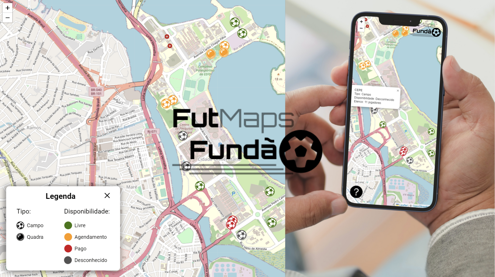

# Fut Maps Fundão 

O ***Fut Maps Fundão*** é um projeto realizado na disciplina de Habilidades Sociais do curso de Ciência da Computação da UFRJ que tem como objetivo o **mapeamento de campos e quadras de futebol da UFRJ campus fundão**. A ideia é criar um ambiente em que calouros possam acessar através da web um mapa interativo contendo os espaços para jogar futebol, além de informações complementares, tais como a disponibilidade do acesso aos locais e número de jogadores suportado para um jogo.  

[→ Acesse agora o Fut Maps Fundão!](https://vlimass.github.io/fut-maps-fundao/)

### 💡 Motivações do projeto 

> A necessidade de fazer esportes 

No nosso curso, tendemos a ficar muito tempo parados. Além disso, o esporte une as pessoas e faz bem para a saúde física e mental. Por isso, nosso grupo propõe estimular a cultura do esporte e facilitar o acesso aos campos e quadras do fundão.

> Volta ao presencial

Quando voltamos para o presencial, nós e os calouros compartilhamos o desconhecimento do espaço do Fundão. Nosso projeto ajuda também a criar um senso de pertencimento à ilha do Fundão.


### 🛠 Tecnologias utilizadas

* HTML 
* CSS
* JavaScript
* Leaflet API

### 🔉 Como cooperar com o projeto?

As informações de campos e quadras presentes no fundão podem ser ainda mais enriquecidas com a contribuição da comunidade! Caso conheça algum outro campo ou informação relacionada e queira contribuir com o projeto, solicite um *pull request* neste repositório do GitHub, adicionando ao arquivo `fields.js` as informações do campo conforme o seguinte exemplo: 

<br>

```
  {
      name: 'Campo descoberto', // nome do campo encontrado
      coordinates: [-22.839027261281725, -43.22886323641195],  // latitude e longitude, respectivamente
      type: 'Campo',  // 'Campo' OU 'Quadra'
      availability: 'Livre',  // 'Livre', 'Agendamento', 'Pago' OU 'Desconhecido'
      numberOfPlayers: 11,  // número de jogadores suportado pelo campo 
      description: '',  // alguma descrição sobre o campo caso ache necessário
  }
```

### 📸 Preview do projeto

<br>




<hr>
<div align="center">made with 🤍 by viny</div>
